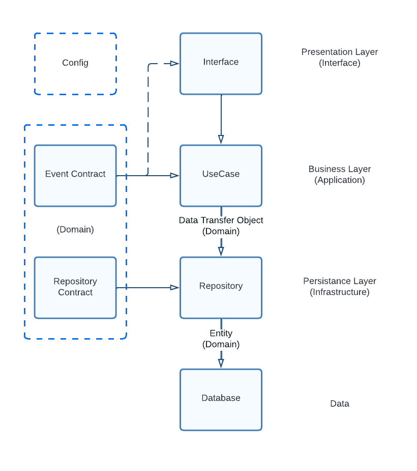

# Device Management System
## Description
This system are created to make the development and monitoring of IoT is more easier with flexible self-hosted visualizer data based on IoT device. 

## Architecture
This system using clean architecture in general but also adapt some concepts and terms of domain driven design to make it more readable, maintainable, structured, and easy to explain. The following picture represent the architecture.


## Configuration
All configuration is in `config.env` file.

## Run Apps
### Run API Test
```
python -m pytest
```
### Run HTTP Server
```
go run cmd/web/main.go
```

## Contribute
Please contact me for contribution as there are no document guidelines for contribution yet.